### Problem (benchmarking_script): 4 points

(a) Here are my scripts used for both benchmark calculating and nsys profiling:   
[[python]](cs336_systems/nsys_profile.py), [[bash]](scripts/run_nsys_profile.sh)

(b) All experiments were conducted on a single NVIDIA RTX 4090 GPU with 24 GB of memory. A complete training step uses AdamW as the optimizer. Results for the remaining model sizes are reported below.

| context_len   | model_tag   | forward(infer) /s   | train_step /s   |
|:--------------|:------------|:--------------------|:----------------|
| 128           | small       | 0.0297 ± 0.0014     | 0.1579 ± 0.0056 |
| 128           | medium      | 0.0564 ± 0.0002     | 0.2633 ± 0.0070 |
| 128           | large       | 0.0839 ± 0.0012     | 0.3663 ± 0.0155 |
| 128           | xl          | 0.1341 ± 0.0031     |                 |
| 128           | 2.7B        | 0.1462 ± 0.0023     |                 |
|               |             |                     |                 |
| 256           | small       | 0.0301 ± 0.0007     | 0.1575 ± 0.0141 |
| 256           | medium      | 0.0627 ± 0.0024     | 0.2625 ± 0.0053 |
| 256           | large       | 0.1111 ± 0.0039     | 0.4080 ± 0.0065 |
| 256           | xl          | 0.1878 ± 0.0054     |                 |
| 256           | 2.7B        | 0.2316 ± 0.0027     |                 |
|               |             |                     |                 |
| 512           | small       | 0.0343 ± 0.0010     | 0.1611 ± 0.0095 |
| 512           | medium      | 0.0984 ± 0.0021     | 0.3007 ± 0.0074 |
| 512           | large       | 0.2057 ± 0.0020     |                 |
| 512           | xl          | 0.3827 ± 0.0030     |                 |
| 512           | 2.7B        | 0.4599 ± 0.0018     |                 |
|               |             |                     |                 |
| 1024          | small       | 0.0882 ± 0.0012     | 0.2561 ± 0.0018 |
| 1024          | medium      | 0.2435 ± 0.0022     |                 |
| 1024          | large       | 0.4673 ± 0.0016     |                 |
| 1024          | xl          | 0.8613 ± 0.0028     |                 |
| 1024          | 2.7B        | 1.0712 ± 0.0016     |                 |

The standard deviation is relatively small.

(c) If warmup=0:
| context_len   | model_tag   | forward(infer) /s   | train_step /s   |
|:--------------|:------------|:--------------------|:----------------|
| 128           | small       | 0.0637 ± 0.1131     | 0.2052 ± 0.1647 |
| 128           | medium      | 0.0957 ± 0.1176     | 0.3197 ± 0.1738 |
| 128           | large       | 0.1242 ± 0.1174     | 0.4391 ± 0.1941 |
| 128           | xl          | 0.1738 ± 0.1237     |                 |
| 128           | 2.7B        | 0.1800 ± 0.1180     |                 |
|               |             |                     |                 |
| 256           | small       | 0.0643 ± 0.1156     | 0.2118 ± 0.1692 |
| 256           | medium      | 0.0977 ± 0.1171     | 0.3203 ± 0.1816 |
| 256           | large       | 0.1512 ± 0.1202     | 0.4536 ± 0.1974 |
| 256           | xl          | 0.2206 ± 0.1171     |                 |
| 256           | 2.7B        | 0.2670 ± 0.1123     |                 |
|               |             |                     |                 |
| 512           | small       | 0.0741 ± 0.1285     | 0.2071 ± 0.1601 |
| 512           | medium      | 0.1308 ± 0.1109     | 0.3567 ± 0.1704 |
| 512           | large       | 0.2411 ± 0.1169     |                 |
| 512           | xl          | 0.4221 ± 0.1189     |                 |
| 512           | 2.7B        | 0.4958 ± 0.1136     |                 |
|               |             |                     |                 |
| 1024          | small       | 0.1260 ± 0.1205     | 0.3089 ± 0.1672 |
| 1024          | medium      | 0.2778 ± 0.1115     |                 |
| 1024          | large       | 0.5021 ± 0.1145     |                 |
| 1024          | xl          | 0.8958 ± 0.1146     |                 |
| 1024          | 2.7B        | 1.1033 ± 0.1126     |                 |

If warmup=1:
| context_len   | model_tag   | forward(infer) /s   | train_step /s   |
|:--------------|:------------|:--------------------|:----------------|
| 128           | small       | 0.0302 ± 0.0026     | 0.1541 ± 0.0033 |
| 128           | medium      | 0.0593 ± 0.0007     | 0.2713 ± 0.0037 |
| 128           | large       | 0.0893 ± 0.0023     | 0.4032 ± 0.0137 |
| 128           | xl          | 0.1341 ± 0.0029     |                 |
| 128           | 2.7B        | 0.1417 ± 0.0061     |                 |
|               |             |                     |                 |
| 256           | small       | 0.0296 ± 0.0003     | 0.1575 ± 0.0054 |
| 256           | medium      | 0.0638 ± 0.0012     | 0.2741 ± 0.0112 |
| 256           | large       | 0.1099 ± 0.0019     | 0.4000 ± 0.0079 |
| 256           | xl          | 0.1909 ± 0.0024     |                 |
| 256           | 2.7B        | 0.2323 ± 0.0033     |                 |
|               |             |                     |                 |
| 512           | small       | 0.0345 ± 0.0011     | 0.1579 ± 0.0037 |
| 512           | medium      | 0.0966 ± 0.0026     | 0.2943 ± 0.0029 |
| 512           | large       | 0.2070 ± 0.0015     |                 |
| 512           | xl          | 0.3789 ± 0.0009     |                 |
| 512           | 2.7B        | 0.4608 ± 0.0018     |                 |
|               |             |                     |                 |
| 1024          | small       | 0.0887 ± 0.0027     | 0.2610 ± 0.0044 |
| 1024          | medium      | 0.2427 ± 0.0032     |                 |
| 1024          | large       | 0.4691 ± 0.0022     |                 |
| 1024          | xl          | 0.8614 ± 0.0062     |                 |
| 1024          | 2.7B        | 1.0677 ± 0.0043     |                 |

Without warm-up, the measured mean runtime is higher and shows larger variance, whereas even a single warm-up iteration leads to much more stable and representative measurements.

### Problem (nsys_profile): 5 points
Also, all experiments were conducted on a single NVIDIA RTX 4090 GPU with 24 GB of memory, using AdamW as optimizer. Below is the result.

| model_tag | context_len | forward(inference)/s | forward(train)/s | backward/s | optimizer_step/s | train_step/s |
|---|---:|---:|---:|---:|---:|---:|
| small | 128 | 0.0296 | 0.0364 | 0.0874 | 0.0324 | 0.1581 |
| medium | 128 | 0.0562 | 0.0661 | 0.1465 | 0.0468 | 0.2634 |
| large | 128 | 0.0834 | 0.0987 | 0.2013 | 0.0576 | 0.3664 |
| xl | 128 | 0.1332 |  |  |  |  |
| 2.7B | 128 | 0.1438 |  |  |  |  |
| small | 256 | 0.0297 | 0.0389 | 0.0873 | 0.0297 | 0.1576 |
| medium | 256 | 0.0619 | 0.0666 | 0.1442 | 0.0481 | 0.2626 |
| large | 256 | 0.1097 | 0.1267 | 0.2152 | 0.0576 | 0.4081 |
| xl | 256 | 0.1858 |  |  |  |  |
| 2.7B | 256 | 0.2262 |  |  |  |  |
| small | 512 | 0.0331 | 0.0391 | 0.0878 | 0.0325 | 0.1613 |
| medium | 512 | 0.0959 | 0.0989 | 0.1463 | 0.0479 | 0.3008 |
| large | 512 | 0.2015 |  |  |  |  |
| xl | 512 | 0.3764 |  |  |  |  |
| 2.7B | 512 | 0.4476 |  |  |  |  |
| small | 1024 | 0.0819 | 0.0843 | 0.0851 | 0.0696 | 0.2562 |
| medium | 1024 | 0.2344 |  |  |  |  |
| large | 1024 | 0.4554 |  |  |  |  |
| xl | 1024 | 0.8444 |  |  |  |  |
| 2.7B | 1024 | 1.0402 |  |  |  |  |

(a) The forward-pass runtime measured by Nsight Systems closely matches the wall-clock measurements obtained using Python’s timeit, indicating that the benchmark accurately captures steady-state GPU execution time.

(b) Using large model with 256 context length as emample:
- forward(inference)

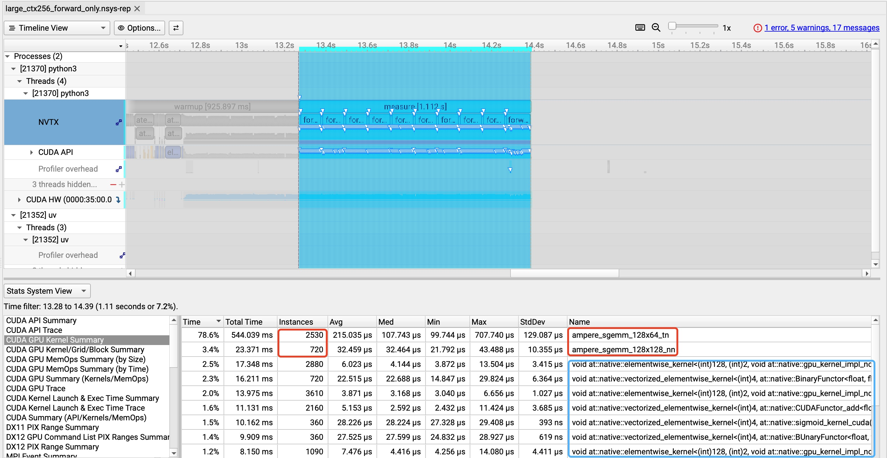

- backward

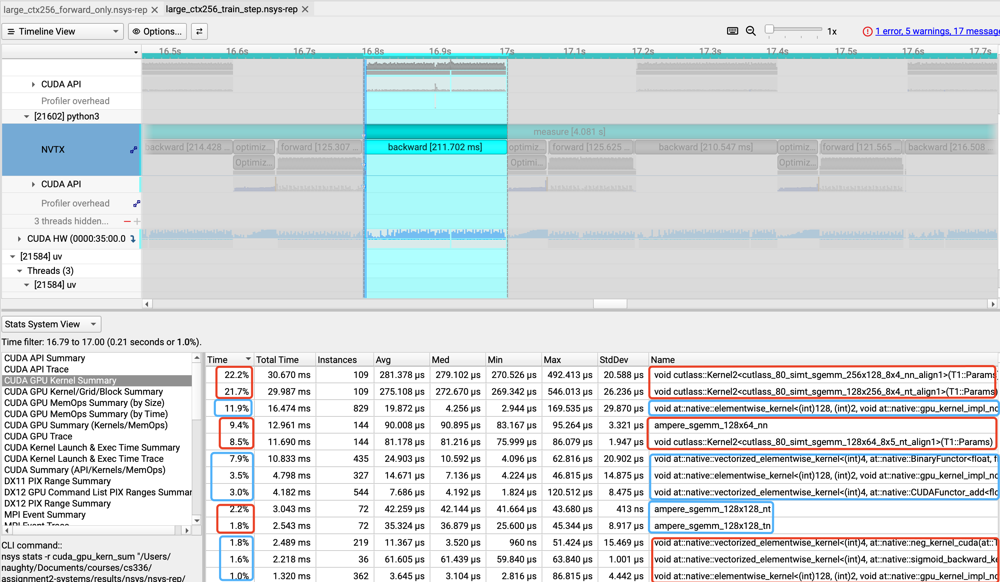

- adamW

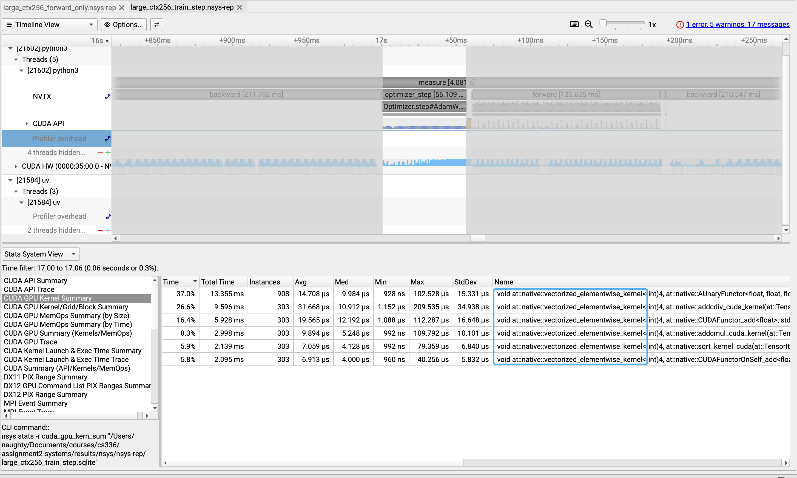

During the forward pass, the CUDA kernel that dominates cumulative GPU time is the GEMM kernel (e.g., ampere_sgemm_128x64_tn), corresponding to the linear layers in attention and MLPs, and it is invoked on the order of thousands of times per forward pass . When running both forward and backward, GEMM kernels still dominate overall runtime, but backward-specific GEMMs (gradient w.r.t. weights/activations) and additional elementwise kernels take a larger fraction, so the single most expensive kernel may differ from the forward-only case.

(c) Besides matrix multiplications, a non-trivial portion of the forward-pass CUDA runtime is spent on elementwise kernels from SwiGLU activations (SiLU and gating), attention softmax and other reduction-based operations, as well as LayerNorm kernels that compute mean/variance and normalization.

(d) While GEMM kernels dominate inference, their relative contribution decreases in a full training step, as backward propagation adds multiple new GEMM variants and the AdamW optimizer is dominated by vectorized elementwise kernels such as addcmul, addcdiv, and sqrt.
- 10 forward(inference) pass


- 10 compelete training steps with adamW

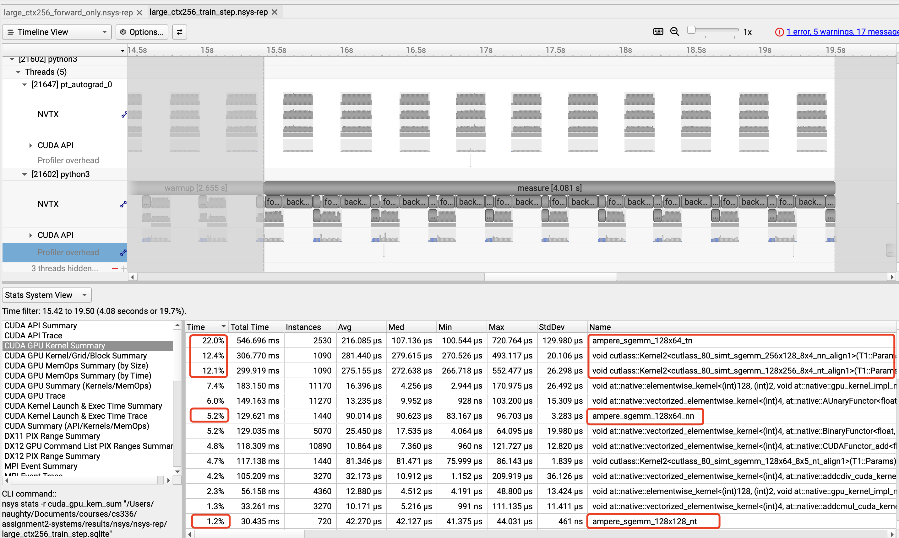

(e)	For the large model with context length 256, the FLOPs are:
-  2BS^2d_h for computing attention scores
- 4BS^2 for softmax
- 2BS^2d_h for the final matmul

giving an approximate FLOP ratio of **64 : 1 : 64**.


In contrast, Nsight Systems reports runtimes of 6.27 ms (scores), 4.09 ms (softmax), and 3.79 ms (final matmul), because:
- softmax is implemented as multiple unfused element-wise kernels with high memory traffic
- computing attention scores additionally includes reshapes and scaling operations beyond pure matrix multiplication.

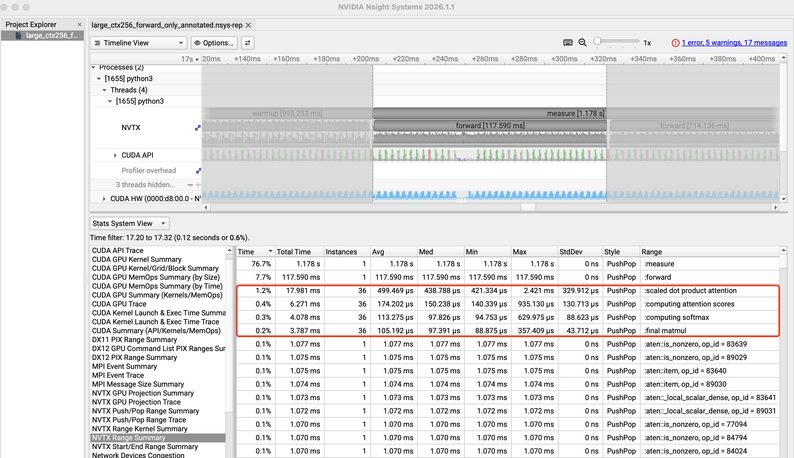

Here is the script used: [[bash]](scripts/run_nsys_profile_annotated_attention.sh)


### Problem (mixed_precision_accumulation): 1 point

This experiment shows that numerical error is dominated by the precision used for accumulation rather than the precision of individual operands. Accumulating FP16 values in FP16 leads to large systematic error due to repeated rounding, while accumulating the same FP16 values in FP32 significantly improves numerical accuracy. This motivates mixed-precision training, where compute-heavy operations use low precision but reductions and accumulations are kept in FP32.

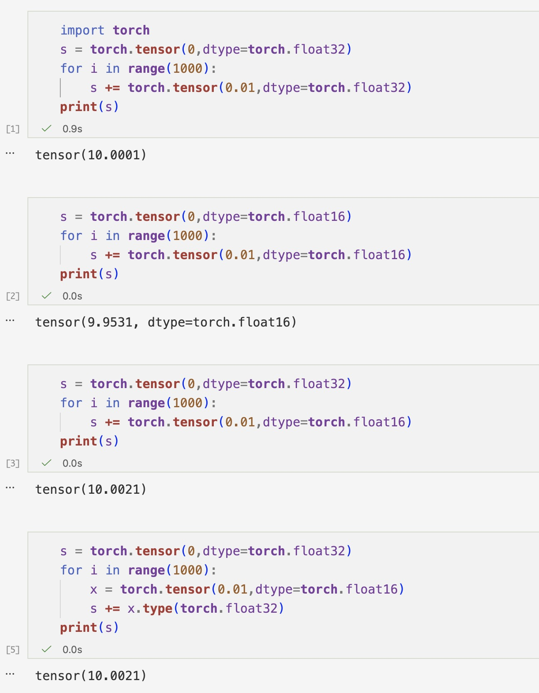


### Problem (benchmarking_mixed_precision): 2 points
(a) The data types for each of the components:  
- parameters: FP32
- fc1 output: FP16
- layernorm output: FP16 (with FP32 internal accumulation/reduction)
- logits (fc2 output): FP16
- loss: FP32
- gradients: FP32

(b) Below is the formula：

1. Calculate RMS:
$\mathrm{RMS}(\mathbf{x}) = \sqrt{\frac{1}{d} \sum_{i=1}^{d} x_i^2 + \epsilon}$

2. Normalize: 
$\hat{x}_i = \frac{x_i}{\mathrm{RMS}(\mathbf{x})}$

3. Scaling:
$y_i = \gamma_i \cdot \hat{x}_i$

Squaring and accumulation operations in layer normalization are sensitive to numerical range, since intermediate values can become large and overflow when using FP16. FP16 has a limited exponent range, making such reductions unstable. In contrast, BF16 has the same exponent range as FP32, so it is much less prone to overflow, and layer normalization does not require special handling when using BF16.

(c) BF16 provides marginal or negative benefits for small models and short contexts, but delivers substantial speedups (≈30–50%) for larger models and longer context lengths, where execution is increasingly dominated by tensor-core–accelerated matrix multiplications.
| model_tag | context_len | forward BF16 /s | forward FP32 /s | forward speedup % | train_step BF16 /s | train_step FP32 /s | train_step speedup % |
|:----------|------------:|:----------------|:----------------|:------------------|:-------------------|:-------------------|:---------------------|
| small | 128 | 0.0301 | 0.0297 | -1.3% | 0.1686 | 0.1579 | -6.8% |
| small | 256 | 0.0311 | 0.0301 | -3.3% | 0.1691 | 0.1575 | -7.4% |
| small | 512 | 0.0324 | 0.0343 | <span style="color:red">+5.5%</span> | 0.1514 | 0.1611 | <span style="color:red">+6.0%</span> |
| small | 1024| 0.0571 | 0.0882 | <span style="color:red">+35.3%</span> | 0.1898 | 0.2561 | <span style="color:red">+25.9%</span> |
|---|---|---|---|---|---|---|---|
| medium | 128 | 0.0639 | 0.0564 | -13.3% | 0.2829 | 0.2633 | -7.4% |
| medium | 256 | 0.0639 | 0.0627 | -1.9% | 0.2827 | 0.2625 | -7.7% |
| medium | 512 | 0.0641 | 0.0984 | <span style="color:red">+34.9%</span> | 0.2698 | 0.3007 | <span style="color:red">+10.3%</span> |
| medium | 1024| 0.1506 | 0.2435 | <span style="color:red">+38.2%</span> | 0.4774 |  |  |
|---|---|---|---|---|---|---|---|
| large | 128 | 0.0954 | 0.0839 | -13.7% | 0.4119 | 0.3663 | -12.4% |
| large | 256 | 0.0979 | 0.1111 | <span style="color:red">+11.9%</span> | 0.4137 | 0.4080 | <span style="color:red">+1.4%</span> |
| large | 512 | 0.1086 | 0.2057 | <span style="color:red">+47.2%</span> |  |  |  |
| large | 1024| 0.2859 | 0.4673 | <span style="color:red">+38.8%</span> |  |  |  |
|---|---|---|---|---|---|---|---|
| xl | 128 | 0.1262 | 0.1341 | <span style="color:red">+5.9%</span> |  |  |  |
| xl | 256 | 0.1346 | 0.1878 | <span style="color:red">+28.3%</span> |  |  |  |
| xl | 512 | 0.1921 | 0.3827 | <span style="color:red">+49.8%</span> |  |  |  |
| xl | 1024| 0.4954 | 0.8613 | <span style="color:red">+42.5%</span> |  |  |  |
|---|---|---|---|---|---|---|---|
| 2.7B | 128 | 0.0982 | 0.1462 | <span style="color:red">+32.8%</span> |  |  |  |
| 2.7B | 256 | 0.1216 | 0.2316 | <span style="color:red">+47.5%</span> |  |  |  |
| 2.7B | 512 | 0.2128 | 0.4599 | <span style="color:red">+53.7%</span> |  |  |  |
| 2.7B | 1024| 0.5232 | 1.0712 | <span style="color:red">+51.1%</span> |  |  |  |

Here is the script used: [[bash]](scripts/run_nsys_profile_mixed_precision.sh)

### Problem (memory_profiling): 4 points

Because my GPU is an RTX 4090 with 24 GB of memory, I chose to run the large model with batch size = 2 and nsteps = 3 to obtain the results. 

- Forward-only timeline: memory ramps up quickly during the first forward as activations / temporary buffers are allocated, then stays almost flat at a steady plateau (most later iterations reuse the same cached blocks, so you don’t see large peaks).

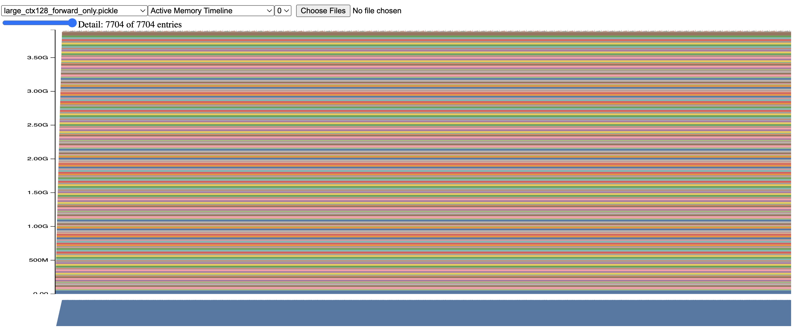

- Train-step timeline: we can visually separate stages: 
1. a rising slope during forward as activations accumulate for autograd
2. a sharp peak when backward materializes large gradient/temporary workspaces, followed by a drop as many forward activations are freed once their gradients are computed
3. a later step-up during optimizer step as AdamW state (m, v buffers) gets allocated and then persists across steps, which shifts the baseline upward for subsequent iterations.

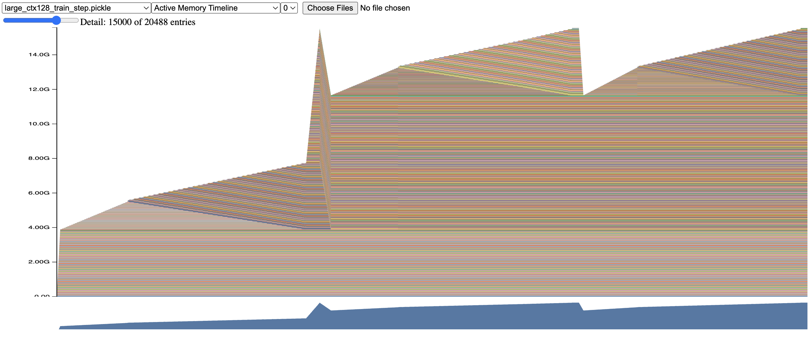

As the context length increases, the forward and backward phases exhibit steeper memory growth and higher peak usage, because activation memory scales linearly with the context length.

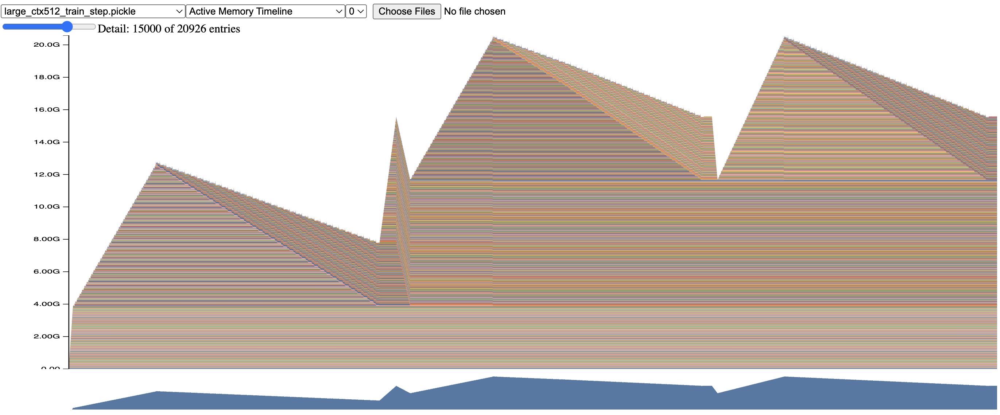

(b)	Forward-only peaks are relatively flat across context lengths because the dominant footprint is parameters and allocator workspaces at this batch size.
Training-step peaks increase with context length since activations (and saved tensors for backward) scale with sequence length; the maximum typically occurs around the end of backward / optimizer step.

- FP32

| Context Length | Forward Peak (GB) | Train Step Peak (GB) |
|---------------:|------------------:|---------------------:|
| 128            | ~3.9              | ~15.5                |
| 256            | ~3.9              | ~15.5                |
| 512            | ~4.0              | ~20.5                |

- BF16

| Context Length | Forward Peak (GB) | Train Step Peak (GB) |
|---------------:|------------------:|---------------------:|
| 128            | ~5.8              | ~15.5                |
| 256            | ~5.8              | ~16.0                |
| 512            | ~5.8              | ~19.5                |

(c) BF16 mixed precision does not significantly reduce peak memory in this setup: forward peaks can even be higher, and training peaks are similar to FP32. This is because parameters, gradients, and AdamW optimizer states remain FP32, while only selected ops run in BF16; allocator workspaces and FP32 reductions further limit memory savings.

Mixed precision mainly reduces activation memory, whose contribution is relatively small at fixed batch size and context length, so the overall peak memory remains similar.

(d) Using large model with context_len=512 as an example, 
 $$ residualstream(Mb) = BSD = 2 * 512 * 1280 * 4 / 1024^2 = 5 $$

(e) The largest allocations shown are approximately 48.8 MiB.
From the stack trace, these allocations originate from large parameter tensors created via empty_strided during model initialization, and their size matches the token embedding (and similarly sized lm_head) weight matrices of shape (V, D) stored in FP32.

$$\text{Memory} = V \times D \times 4 \;\text{bytes} = 10000 \times 1280 \times 4 \approx 48.8\;\text{MiB}$$

```
328 Addr: b'7fa1c6000000_0, Size: 48.8MiB (51200000 bytes) allocation, Total memory used after allocation: 3.6GiB (3877778432 bytes), Compile context: None, timestamp Thu Jan 29 2026 17:29:42 GMT+0800 (China Standard Time)
CUDACachingAllocator.cpp:0:c10::cuda::CUDACachingAllocator::Native::DeviceCachingAllocator::malloc(signed char, unsigned long, CUstream_st*)
...
/usr/local/src/conda/python-3.12.3/Objects/descrobject.c:365:method_vectorcall_VARARGS_KEYWORDS
/root/autodl-tmp/cs336-assignment2/.venv/lib/python3.12/site-packages/torch/nn/modules/module.py:1329:convert
??:0:__libc_init_first
/root/autodl-tmp/cs336-assignment2/.venv/lib/python3.12/site-packages/torch/nn/modules/module.py:930:_apply
/root/autodl-tmp/cs336-assignment2/.venv/lib/python3.12/site-packages/torch/nn/modules/module.py:903:_apply
/root/autodl-tmp/cs336-assignment2/.venv/lib/python3.12/site-packages/torch/nn/modules/module.py:1343:to
```

The second-largest allocations are ~25.0 MiB, which matches the size of an FP32 $D\times F (or F\times D)$ matrix in the FFN:
$$\text{Memory}=D\cdot F \cdot 4 = 1280 \times 5120 \times 4 = 26{,}214{,}400\ \text{bytes} \approx 25.0\ \text{MiB}$$
My guess is that these blocks correspond to the per-layer feed-forward Linear weights (and, in training runs, additional same-sized tensors such as gradients and AdamW moment buffers).

The next most frequent large allocations are around 6.3 MiB, which closely match the size of a single $D \times D$ weight matrix in FP32.
For the large model with D=1280, this is $1280^2 \times 4 \approx 6.25 MiB$, corresponding to per-layer linear projection weights in self-attention (e.g. $W_q, W_k, W_v, W_o$), and they appear repeatedly because each Transformer layer contains several such matrices (and their associated buffers).

Here is the script used: [[bash]](scripts/run_mem_profile.sh)

### Problem (pytorch_attention): 2 points

- when context_len = 16384, I got OOM error.

- The smallest configuration that runs out of memory is: context_len = 16384, d_model = 16.

    For B=8 and S=8192, a single $B \times S \times S$ attention tensor in float32 requires about 2 GiB. In naive attention, both the attention logits and softmax-related tensors of this size are retained for backward, resulting in roughly 4 GiB of memory usage before backward, consistent with our measurements. Since attention memory scales as O($BS^2$), increasing the sequence length to S=16384 quadruples this cost, causing the peak memory usage to exceed the 24 GiB capacity of an RTX 4090 and leading to out-of-memory errors.

- The dominant saved tensors are B\times S\times S (attention logits/softmax-related values), so $M_{\text{saved}} = \Theta(BS^2)$. To eliminate this memory cost, we can use FlashAttention / tiled online softmax or activation checkpointing / recomputation.

Here are the time and memory results:
- d_model = 16

| S | forward (ms) | backward (ms) | mem before (MiB) | peak (MiB) |
|---|--------------|---------------|------------------|------------|
| 256 | 0.29 | 0.55 | 20.90 | 29.02 |
| 1024 | 0.43 | 1.06 | 84.34 | 212.84 |
| 4096 | 9.81 | 20.71 | 1080.63 | 3130.63 |
| 8192 | 38.87 | 81.86 | 4257.00 | 12453.00 |
| 16384 | OOM | OOM | OOM | OOM |

- d_model = 32

| S | forward (ms) | backward (ms) | mem before (MiB) | peak (MiB) |
|---|--------------|---------------|------------------|------------|
| 256 | 0.37 | 0.63 | 21.40 | 29.65 |
| 1024 | 0.41 | 1.04 | 86.34 | 215.34 |
| 4096 | 9.89 | 20.83 | 1088.63 | 3140.63 |
| 8192 | 38.99 | 82.09 | 4273.00 | 12473.00 |
| 16384 | OOM | OOM | OOM | OOM |

- d_model = 64

| S | forward (ms) | backward (ms) | mem before (MiB) | peak (MiB) |
|---|--------------|---------------|------------------|------------|
| 256 | 0.30 | 0.54 | 22.40 | 30.90 |
| 1024 | 0.43 | 1.09 | 90.34 | 220.34 |
| 4096 | 9.98 | 20.95 | 1104.63 | 3160.63 |
| 8192 | 39.25 | 82.56 | 4305.00 | 12513.00 |
| 16384 | OOM | OOM | OOM | OOM |

- d_model = 128

| S | forward (ms) | backward (ms) | mem before (MiB) | peak (MiB) |
|---|--------------|---------------|------------------|------------|
| 256 | 0.29 | 0.57 | 24.40 | 33.40 |
| 1024 | 0.45 | 1.17 | 98.34 | 230.34 |
| 4096 | 10.40 | 21.47 | 1136.63 | 3200.63 |
| 8192 | 40.83 | 84.24 | 4369.00 | 12593.00 |
| 16384 | OOM | OOM | OOM | OOM |

Here is the script used: [[bash]](scripts/run_attn_benchmark.sh), here is the script used to write table: [[python]](utils/make_tables_for_attn_benchmark.py).

### Problem (torch_compile): 2 points
(a)
- d_model = 16

| S | forward (ms) | backward (ms) | mem before (MiB) | peak (MiB) |
|---|--------------|---------------|------------------|------------|
| 256 | 0.31 | 0.52 | 20.84 | 24.97 |
| 1024 | 0.35 | 0.72 | 83.38 | 147.88 |
| 4096 | 2.88 | 8.12 | 1064.75 | 2090.75 |
| 8192 | 10.81 | 31.03 | 4193.25 | 8293.25 |
| 16384 | OOM | OOM | OOM | OOM |

- d_model = 32

| S | forward (ms) | backward (ms) | mem before (MiB) | peak (MiB) |
|---|--------------|---------------|------------------|------------|
| 256 | 0.38 | 0.49 | 21.34 | 25.59 |
| 1024 | 0.36 | 0.75 | 85.38 | 150.38 |
| 4096 | 2.84 | 8.14 | 1072.75 | 2100.75 |
| 8192 | 10.86 | 31.01 | 4209.25 | 8313.25 |
| 16384 | OOM | OOM | OOM | OOM |

- d_model = 64

| S | forward (ms) | backward (ms) | mem before (MiB) | peak (MiB) |
|---|--------------|---------------|------------------|------------|
| 256 | 0.25 | 0.37 | 22.34 | 26.84 |
| 1024 | 0.33 | 0.74 | 89.38 | 155.38 |
| 4096 | 2.94 | 8.15 | 1088.75 | 2120.75 |
| 8192 | 11.11 | 31.33 | 4241.25 | 8353.25 |
| 16384 | OOM | OOM | OOM | OOM |

- d_model = 128

| S | forward (ms) | backward (ms) | mem before (MiB) | peak (MiB) |
|---|--------------|---------------|------------------|------------|
| 256 | 0.34 | 0.51 | 24.34 | 29.34 |
| 1024 | 0.37 | 0.79 | 97.38 | 165.38 |
| 4096 | 3.30 | 8.64 | 1120.75 | 2160.75 |
| 8192 | 12.40 | 33.03 | 4305.25 | 8433.25 |
| 16384 | OOM | OOM | OOM | OOM |

Compared to eager execution, torch.compile significantly reduces both forward and backward runtimes, and also lowers the peak memory usage during backward. However, the memory saved for backward remains dominated by the O(BS^2) attention activations, so the out-of-memory boundary is unchanged.

| Forward time | Backward time |
|-------------|---------------|
| 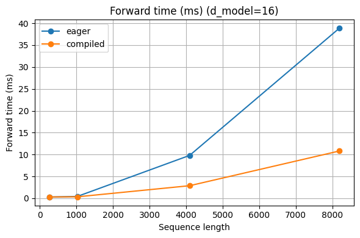 | 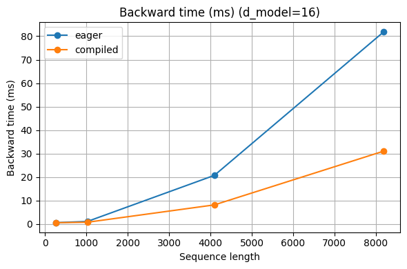 |

| Memory before backward | Peak memory |
|------------------------|-------------|
| 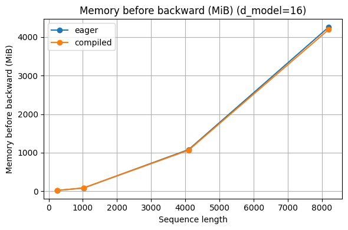 | 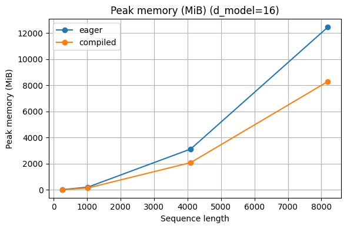 |

Here is the script used: [[bash]](scripts/run_attn_benchmark_compile.sh), here is the script used to write table: [[python]](utils/make_tables_for_attn_benchmark.py).

(b) With batch size 4 and BF16 enabled, torch.compile provides up to ~5× speedup for forward-only inference and ~2–3× speedup for end-to-end training (forward + backward + optimizer). Peak memory usage is reduced by ~30–45% in inference and up to ~30% during training, which slightly delays OOM in some borderline cases but does not fundamentally change the OOM limit for large models or long context lengths.
- mode = forward_only

| model_tag | context_len | eager mean (ms) | compiled mean (ms) | speedup | eager peak (MiB) | compiled peak (MiB) | mem saving |
|---|---:|---:|---:|---:|---:|---:|---:|
| small | 128 | 18.85 | 3.81 | 4.94x | 773.9 | 525.4 | 32.11% |
| small | 256 | 18.05 | 4.32 | 4.18x | 785.8 | 541.8 | 31.05% |
| small | 512 | 18.84 | 6.52 | 2.89x | 896.3 | 590.8 | 34.08% |
| small | 1024 | 53.72 | 15.44 | 3.48x | 1350.6 | 723.0 | 46.47% |
| medium | 128 | 34.99 | 7.58 | 4.62x | 2425.1 | 1656.4 | 31.70% |
| medium | 256 | 35.45 | 10.00 | 3.55x | 2438.4 | 1672.4 | 31.41% |
| medium | 512 | 47.45 | 18.47 | 2.57x | 2586.8 | 1746.5 | 32.49% |
| medium | 1024 | 143.12 | 44.60 | 3.21x | 3191.7 | 1914.6 | 40.01% |
| large | 128 | 60.47 | 17.28 | 3.50x | 5652.1 | 3857.3 | 31.75% |
| large | 256 | 57.02 | 23.19 | 2.46x | 5673.0 | 3879.8 | 31.61% |
| large | 512 | 94.39 | 42.54 | 2.22x | 5854.0 | 3969.9 | 32.18% |
| large | 1024 | 273.17 | 95.90 | 2.85x | 6606.2 | 4190.0 | 36.57% |
| xl | 128 | 80.79 | 29.83 | 2.71x | 11697.6 | 7871.6 | 32.71% |
| xl | 256 | 93.77 | 47.56 | 1.97x | 11660.5 | 7899.7 | 32.25% |
| xl | 512 | 172.55 | 84.70 | 2.04x | 11857.6 | 8012.3 | 32.43% |
| xl | 1024 | 478.69 | 183.88 | 2.60x | 12826.0 | 8287.4 | 35.39% |
| 2.7B | 128 | 73.29 | 46.83 | 1.56x | 19599.1 | 13249.3 | 32.40% |
| 2.7B | 256 | 95.91 | 71.16 | 1.35x | 19647.8 | 13311.3 | 32.25% |
| 2.7B | 512 | 202.54 | 126.22 | 1.60x | 19824.8 | 13459.4 | 32.11% |
| 2.7B | 1024 | 520.22 | 253.05 | 2.06x | 21048.9 | 13851.6 | 34.19% |

- mode = train_step

| model_tag | context_len | eager mean (ms) | compiled mean (ms) | speedup | eager peak (MiB) | compiled peak (MiB) | mem saving |
|---|---:|---:|---:|---:|---:|---:|---:|
| small | 128 | 111.51 | 55.25 | 2.02x | 2235.9 | 2079.5 | 7.00% |
| small | 256 | 111.07 | 45.99 | 2.42x | 2803.7 | 2432.4 | 13.24% |
| small | 512 | 112.69 | 39.68 | 2.84x | 4224.6 | 3374.3 | 20.13% |
| small | 1024 | 170.71 | 61.94 | 2.76x | 8727.0 | 6142.1 | 29.62% |
| medium | 128 | 182.48 | 78.55 | 2.32x | 6764.3 | 6534.4 | 3.40% |
| medium | 256 | 192.23 | 92.59 | 2.08x | 8144.0 | 7223.0 | 11.31% |
| medium | 512 | 188.30 | 84.92 | 2.22x | 11803.3 | 9556.3 | 19.04% |
| medium | 1024 | 463.68 | 171.74 | 2.70x | 23100.6 | 16534.3 | 28.42% |
| large | 128 | 248.26 | 117.40 | 2.11x | 15378.7 | 15277.9 | 0.66% |
| large | 256 | 266.03 | 128.23 | 2.07x | 17883.7 | 16145.4 | 9.72% |
| large | 512 | OOM | 188.21 | - | OOM | 20368.7 | - |
| large | 1024 | OOM | OOM | - | OOM | OOM | - |
| xl | 128 | OOM | OOM | - | OOM | OOM | - |
| xl | 256 | OOM | OOM | - | OOM | OOM | - |
| xl | 512 | OOM | OOM | - | OOM | OOM | - |
| xl | 1024 | OOM | OOM | - | OOM | OOM | - |
| 2.7B | 128 | OOM | OOM | - | OOM | OOM | - |
| 2.7B | 256 | OOM | OOM | - | OOM | OOM | - |
| 2.7B | 512 | OOM | OOM | - | OOM | OOM | - |
| 2.7B | 1024 | OOM | OOM | - | OOM | OOM | - |

Here is the script used to calculate: [[bash]](scripts/run_nsys_profile_compile.sh), here is the script used to write table: [[python]](utils/make_tables_for_model_benchmark.py).

### Problem (flash_forward): 15 points / Problem (flash_backward): 5 points
Code files are put at this [folder](cs336_systems/flash_attn/).

### Problem (flash_benchmarking): 5 points
Temp pass

### Problem (distributed_communication_single_node): 5 points
code file: [[python]](cs336_systems/ddp/all_reduce_benchmark.py)

All NCCL experiments were conducted on a Linux machine equipped with NVIDIA GeForce RTX 4090 GPUs. The GPUs are interconnected via PCIe (no NVLink support on RTX 4090), and communication was performed using the NCCL backend.

Reported results use the maximum latency across ranks to reflect the true distributed synchronization cost.

- world size = 2

| Size   | NCCL Time (s) | NCCL Bandwidth (GB/s) | Gloo Time (s) | Gloo Bandwidth (GB/s) | Speedup (NCCL/Gloo) |
|--------|---------------|------------------------|---------------|------------------------|---------------------|
| 1MB    | 0.000095      | 10.28                  | 0.001189      | 0.82                   | 12.5×               |
| 10MB   | 0.000731      | 13.36                  | 0.002751      | 3.55                   | 3.8×                |
| 100MB  | 0.006958      | 14.03                  | 0.032741      | 2.98                   | 4.7×                |
| 1024MB | 0.069285      | 14.43                  | 0.329153      | 3.11                   | 4.7×                |
- world size = 4

| Size   | NCCL Time (s) | NCCL Bandwidth (GB/s) | Gloo Time (s) | Gloo Bandwidth (GB/s) | Speedup (NCCL/Gloo) |
|--------|---------------|------------------------|---------------|------------------------|---------------------|
| 1MB    | 0.000138      | 7.08                   | 0.001727      | 0.57                   | 12.5×               |
| 10MB   | 0.000976      | 10.00                  | 0.006178      | 1.58                   | 6.3×                |
| 100MB  | 0.009584      | 10.19                  | 0.060768      | 1.61                   | 6.3×                |
| 1024MB | 0.096291      | 10.39                  | 0.620225      | 1.65                   | 6.4×                |
- world size = 6

| Size   | NCCL Time (s) | NCCL Bandwidth (GB/s) | Gloo Time (s) | Gloo Bandwidth (GB/s) | Speedup (NCCL/Gloo) |
|--------|---------------|------------------------|---------------|------------------------|---------------------|
| 1MB    | 0.000199      | 4.91                   | 0.002361      | 0.42                   | 11.9×               |
| 10MB   | 0.001063      | 9.19                   | 0.009966      | 0.98                   | 9.4×                |
| 100MB  | 0.010116      | 9.66                   | 0.096754      | 1.01                   | 9.6×                |
| 1024MB | 0.101996      | 9.80                   | 0.993966      | 1.01                   | 9.8×                |


#### Conclusion 1: NCCL (GPU) is significantly faster than Gloo (CPU) and demonstrates better scalability
NCCL is significantly faster than Gloo because it uses direct GPU peer-to-peer communication over PCIe, while Gloo relies on CPU-based TCP communication with substantially higher overhead.

As world size increases, NCCL shows significantly better scalability compared to Gloo. While Gloo runtime grows nearly linearly with the number of processes due to TCP and CPU overhead, NCCL maintains relatively stable effective bandwidth because of its optimized ring-based collective algorithm and GPU peer-to-peer communication.
#### Conclusion 2: Increasing world size leads to higher runtime
Because more processes must synchronize and share communication bandwidth, leading to higher collective overhead.
#### Conclusion 3: Large tensors are bandwidth-bound, small tensors are latency-bound
For small tensor sizes (e.g., 1MB), runtime is dominated by communication latency and synchronization overhead. As tensor size increases (100MB–1GB), runtime grows approximately linearly with data size, indicating a bandwidth-bound regime where throughput is limited by the underlying interconnect bandwidth.
